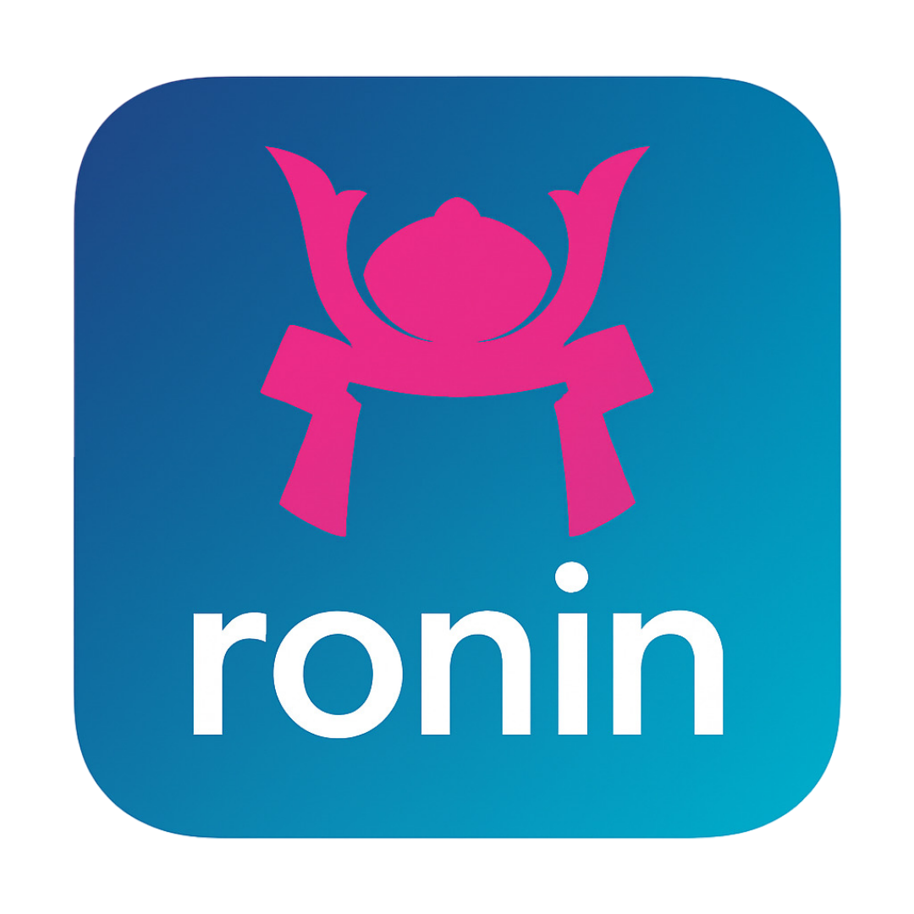

# Ronin 🐉

> Minimalist container runtime using Linux syscalls — no Docker, no Podman, no daemon.

Ronin is a [Rust](https://www.rust-lang.org/)-based container tool that uses **Linux kernel features** (namespaces, cgroups, mount, chroot) to run isolated processes — without any external dependencies.

Perfect for developers who want full control, transparency, and no vendor lock-in.

## 🚀 Features

- ✅ Rootless by default
- ✅ No daemon, no images, no registries
- ✅ Uses Linux syscalls directly (`unshare`, `mount`, `chroot`, `pivot_root`)
- ✅ CLI with `clap` — intuitive and extensible
- ✅ Built in Rust — safe, fast, portable
- ✅ Works on any Linux system with kernel ≥ 4.18

## 📦 Installation

Ronin is **not yet released** — you need to build it from source.

### Prerequisites

- Rust (≥ 1.70)
- `gcc`, `make`, `pkg-config` (for native dependencies)
- Linux kernel with support for:
  - Namespaces (`CLONE_NEWNS`, `CLONE_NEWPID`, etc.)
  - cgroups v2 (optional, for resource limits)
  - `mount`, `chroot`, `pivot_root`

> 💡 **Recommended setup**:  
> Use **Fedora Silverblue** + **distrobox** with `fedora:42` image — perfect for kernel experiments.

## 🛠️ Development

To build and test Ronin locally, follow these steps:

### 1. Install Rust

```bash
curl --proto '=https' --tlsv1.2 -sSf https://sh.rustup.rs | sh
```

### 2. Install C toolchain (required for `nix`, `libc`, `cgroups-rs`)

```bash
sudo dnf install -y gcc make pkg-config clang
```

> 🐧 **On Fedora Silverblue / distrobox**:  
> Run this inside your `distrobox` — not on the host.

### 3. Clone the repo

```bash
git clone https://github.com/kkroesch/ronin.git
cd ronin
```

### 4. Build

```bash
cargo build
```

### 5. Run tests (if any)

```bash
cargo test
```

### 6. Run locally

```bash
cargo run -- run --root /tmp/rootfs --mount /host/app:/app --port 3000:3000 /bin/bash
```

> 📝 **Note**: You need a valid rootfs (e.g., from `docker export` or `buildah`).

---

## 📜 Usage

### Run a container

```bash
ronin run --root /path/to/rootfs --mount /host/dir:/container/dir --port 3000:3000 --user 1000 /bin/bash
```

### Available subcommands

- `run` — Start a container
- `build` — (future) Build a rootfs
- `exec` — (future) Execute command in running container
- `ps` — (future) List containers
- `rm` — (future) Remove container

---

## 🧩 Architecture

Ronin is built in Rust with:

- `clap` — for CLI parsing
- `nix` — for Linux syscalls (namespaces, mount, chroot)
- `cgroups-rs` — for resource limits (CPU, RAM, IO)
- `anyhow` — for error handling
- `env_logger` — for debugging

Modules are split into:

- `src/main.rs` — CLI entry point
- `src/run.rs` — Container execution logic
- `src/build.rs` — (future) Image building
- `src/exec.rs` — (future) Command execution

---

## 🤝 Contributing

Contributions are welcome! Please:

1. Fork the repo
2. Create a feature branch
3. Commit your changes
4. Push to the branch
5. Open a Pull Request

---

## 📄 License

MIT — see [LICENSE](LICENSE) for details.

---

## 🙏 Thanks

Ronin is inspired by the simplicity of Linux kernel features — and the desire to avoid Docker’s complexity.

Made with ❤️ by [Karsten Kroesch](https://github.com/kkroesch).
```
